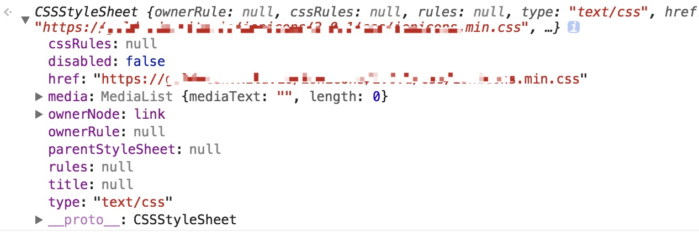

# DOM2和DOM3

### 样式
* HTML中定义样式的方式
  1. `<link />`
  2. `<style />`
  3. `style`内联样式
* 确定浏览器是否支持DOM2级定义的CSS能力
```
var supportsDOM2CSS = document.implementation.hasFeature('CSS','2.0');
var suppotrsDOM2CSS2 = document.implementation.hasFeature('CSS2','2.0')
```
* style对象是CSSStyleDeclaration的实例，style对象不包括外部样式表（`<link />`）、嵌入样式表的样式（`<style />`）
```
element.style.width = '100px';
element.style.backgroundColor = 'green';
element.style.border = '1px solid black';
```
* style对象的属性方法
  1. cssText
    * 获取css代码 `element.style.cssText`
    * 设置（重写）css代码 `element.style.cssText = 'width:25px;height:100px;'`
  2. length
    * `element.style[i]`
    * `element.style.item(i)`
  3. parentRule
  4. getPropertyCSSValue(propertyName)
    * 返回cssText和cssValueType
  5. cssValueType
    * 0 - 继承的值
    * 1 - 基本的值
    * 2 - 值列表
    * 3 - 自定义的值
  6. getPropertyPriority(propertyName)
    * 返回优先权标识符
  7. getPropertyValue(propertyName)
    * 常用
    * 返回cssText
  8. item(index)
  9. removeProperty(propertyName)
    `element.removeProperty('border')`
  10. setProperty(propertyName, value, priority)
* 计算的样式
  1. document.getComputedStyle()
    * IE不支持，但支持currentStyle属性
    * 接受两个参数，第一个参数是元素element,第二个参数是伪元素或者null
    ```
    document.defaultView.getComputedStyle(element, null);
    document.defaultView.getComputedStyle(element, ':after');
    ```
  2. element.currentStyle
    ```
    var computedStyle = element.currentStyle;
    alert(computedStyle.backgroundColor);
    ```
* 操作样式表
  * CSSStyleSheet类型表示的是样式表，包括`<link />`(HTMLLinkElement)和`<style>`(HTMLStyleElement)
  * CSSStyleSheet继承自StyleSheet
  * `document.styleSheets`获取页面中所有的样式表
  ```
  var s = document.styleSheets;
  console.log(s[0]); // 获取第一个样式表信息
  ```
  * styleSheets的属性
    1. cssRules
    2. disabled
    3. href
    4. media
    5. ownerNode
    6. ownerRule
    7. parentStyleSheet
    8. rules
    9. title
    10. type
    
  * css规则 `cssRules`
    1. `<style />`中有这个属性
    2. 修改样式
    ```
    var sheet = document.styleSheets[0];
    var rules = sheet.cssRules || sheet.rules;
    var rule = rules[0];
    rule.style.backgroundColor = 'red';
    ```
  * 创建规则
  ```
  sheet.insertRule( 'body { background-color:silver}', 0 ); // 0代表位置
  sheet.addRule( 'body', 'background-color:silver', 0); // ie，最多插入4095条
  ```
  * 删除规则
  ```
  sheet.deleteRule(0); // 0代表位置
  sheet.removeRule(0); // ie
  ```
  ```
  function deleteRule(sheet, index){
    if(sheet.deleteRule){
      sheet.deleteRule(index);
    }else if(sheet.removeRule){
      sheet.removeRule(index);
    }
  }
  ```

### 元素大小
* 偏移量 offset dimension
```
offsetHeight
offsetWidth
offsetLeft
offsetTop
```
* 客户区大小 client dimension
```
clientWidth
clientHeight
```
* 滚动大小 scroll dimension
```
scrollHeight
scrollWidth
scrollLeft
scrollTop
```
* 确定元素大小

### 遍历
1. NodeIterator
  * `nextNode()`
  * `previousNode()`
2. TreeWalker
  * `parentNode()`
  * `firstChild()`
  * `lastChild()`
  * `nextSibling()`
  * `previousSibling()`

### 范围
