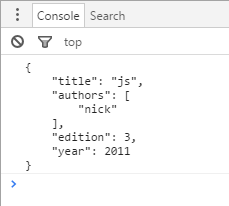

# 第二十章 JSON

## 概念
* 由于 *结构化数据XML* 过于繁琐冗长，出现了JSON（Javascript Object Notation JS对象表示法）
* XML：XML数据结构要解析成DOM文档，提取数据也很麻烦
* JSON：可以解析成JS对象，直接用点语法调用
* JSON是一种数据格式，而不是编程语言，所以不是只有JS才能访问JSON，很多编程语言都有针对JSON的解析器和序列化器。

## 语法
* 简单值
```
"Hello"
5
```
* 对象
```
{
"name":"Nick",
"age":29
}
```
* 数组
```
[25,"hi",true]
```
## 解析与序列化
1. 序列化 JSON.stringify() 把JS对象序列化成JSON字符串
    * 第一个参数是要序列化的JS对象
    * 第二个参数是过滤器参数，可以是数组，也可以是函数
    ```
    var book={
        "title":"js",
        "authors":["nick"],
        edition:3,
        year:2011
    }
    //var jsonText=JSON.stringify(book);// {"title":"js","authors":["nick"],"edition":3,"year":2011}

    //数组过滤器
    //过滤后只剩authors属性
    //var jsonText=JSON.stringify(book,["authors"]);// {"authors":["nick"]}

    //函数过滤器
    var jsonText=JSON.stringify(book,function(key,value){// {"title":"js","authors":["nick"],"edition":3,"year":5000}
        switch(key){
            case "author":
                return value.join(",")
            case "year":
                return 5000
            case "edtion":
                return undefined
            default:
                return value
        }
    });
    console.log(jsonText);
    ```
    * 第三个参数控制字符缩进，最大为10
    ```
    var book={
        "title":"js",
        "authors":["nick"],
        edition:3,
        year:2011
    }
    var jsonText=JSON.stringify(book,null,4);
    console.log(jsonText)
    ```
    
    * toJSON()方法
    ```
    var book={
        "title":"js",
        "authors":["nick"],
        edition:3,
        year:2011,
        toJSON:function(){
            return this.title;
        }
    }
    var jsonText=JSON.stringify(book);
    console.log(jsonText) //"js"
    ```
    * 序列化的顺序：
        1. 存在toJSON()，并可以取到有效值，则调用该方法
        2. 提供第二个参数，则应用这个函数过滤，传入函数过滤的值是第一步返回的值
        3. 对第二步返回的值进行相应的序列化
        4. 提供第三个参数，执行格式化

2. 解析 parse()
```
var book={
    "title":"js",
    "authors":["nick"],
    edition:3,
    year:2011,
    releaseDate:new Date(2011,11,1)
}
var jsonText=JSON.stringify(book);
//var bookCopy=JSON.parse(jsonText);
var bookCopy=JSON.parse(jsonText,function(key,value){
    if(key=="releaseDate"){
        return new Date(value);
    }else{
        return value
    }
});
console.log(bookCopy.releaseDate.getFullYear()) //2011
```
