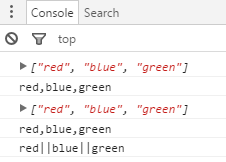
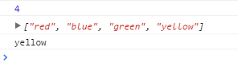
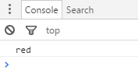
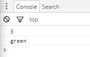
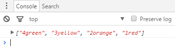
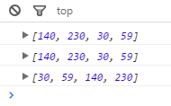
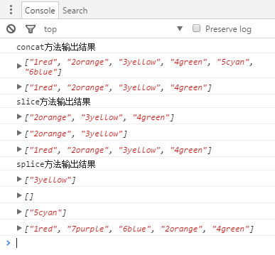
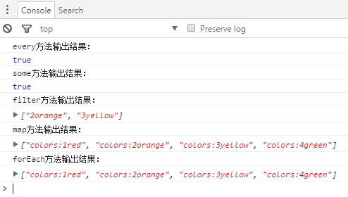
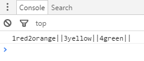

# 第五章 引用类型

## Array类型

1. 创建Array实例的方法
    1. new
    ```
    var colors = new Array();
    var colors = new Array("red","yellow","blue");
    ```
    2. 数组字面量表示法
    ```
    var colors = [];
    var colors = ["red","yellow","blue"];
    ```

2. 访问数组的值
    ```
    alert(colors[2]);
    ```

3. length 可读取；可写入
    ```
    colors.length = 1;
    ```

4. 转换方法
    ```
    var colors = ["red","blue","green"];
    console.log(colors)
    console.log(colors.toString())
    console.log(colors.valueOf())
    console.log(colors.toLocaleString())
    console.log(colors.join("||"))
    ```
    

5. 栈方法
    * 为数组提供类似栈的数据结构
    * push() pop()，后进先出LIFO，后端添加 后端移除
    ```
    var colors = ["red","blue","green"];
    var item = colors.push("yellow");
    console.log(item);
    console.log(colors);
    item = colors.pop();
    console.log(item);
    ```
    

6. 队列方法
    1. push() shift()，先进先出FIFO，后端添加 前端移除
    ```
    var colors = ["red","blue","green"];
    var item = colors.shift();
    console.log(item);
    ```
    

    2. unshift() pop()，前端添加 后端移除
    ```
    var colors = [];
    var item = colors.unshift("red","blue","green");
    console.log(item);  //IE7及更早IE版本会返回undefined
    item = colors.pop();
    console.log(item);
    ```
    

7. 重排序方法
    1. 翻转数组 colors.reverse()
    ```
    var colors = ["1red", "2orange", "3yellow", "4green"];
    var item = colors.reverse();
    console.log(item)
    ```
    

    2. 升序排列数组 colors.sort() ：调用toString()后比较字符串的升序排列
    ```
    var num = [59,230,140,30];
    var item = num.sort();  //其实是字符串的比较
    console.log(item);
    console.log(num);   //本身的数组也会改变
    //升序排列函数，适用于大多数数据类型
    function compare(value1,value2){
        if(value1<value2){
            return -1;
        }else if(value1>value2){
            return 1;   //1，互换值位置
        }else{
            return 0;
        }
    }
    num.sort(compare);
    console.log(num);
    ```
    

    ```
    //升序排列函数，适用于数值类型
    function compare(value1,value2){
        return value1-value2
    }
    ```

8. 操作方法
    1. concat()
    2. slice()
    3. splice()
    ```
    var colors = ["1red", "2orange", "3yellow", "4green"];
    // concat
    var item_concat = colors.concat("5cyan","6blue");
    console.log("concat方法输出结果");
    console.log(item_concat);
    console.log(colors);    //原始数组未改变
    // slice
    var item_slice1 = colors.slice(1);
    var item_slice2 = colors.slice(1,3);
    console.log("slice方法输出结果");
    console.log(item_slice1);
    console.log(item_slice2);
    console.log(colors);    //原始数组未改变
    // splice
    console.log("splice方法输出结果");
    var item_splice1 = colors.splice(2,1);  //删除，删除索引从2开始（包括2）的1个
    console.log(item_splice1);  //返回被删除的项
    var item_splice2 = colors.splice(1,0,"5cyan","6blue");  //插入，从索引是1的位置添加，0是要删除的个数
    console.log(item_splice2);  //返回空
    var item_splice3 = colors.splice(1,1,"7purple");    //替换，删除索引从1开始（包括1）的1个，并添加
    console.log(item_splice3);  //返回被删除的项
    console.log(colors);    //原始数组未改变
    ```
    

9. 位置方法 IE9+
    1. indexOf()，从数组开头向后查找
    2. lastIndexOf()，从数组的末尾向前查找
    ```
    var colors = ["1red", "2orange", "3yellow", "4green"];
    var item_indexof = colors.indexOf("2orange");   //查找2orange的索引值
    console.log(item_indexof)   //返回1
    ```

10. 迭代方法 IE9+
    1. every()
    2. filter()
    3. forEach()
    4. map()
    5. some()
    ```
    var colors = ["1red", "2orange", "3yellow", "4green"];
    ```
    ```
    // every
    var item_every = colors.every(function(item,index,array){
        return (item.length>1);//每一项都true 则返回true
    });
    console.log("every方法输出结果：");
    console.log(item_every);//输出true
    ```
    ```
    // some
    var item_some = colors.some(function(item,index,array){
        return (item.length>6);//有一项true 则返回true
    });
    console.log("some方法输出结果：");
    console.log(item_some);//输出true
    ```
    ```
    // filter
    var item_filter = colors.filter(function(item,index,array){
        return (item.length>6);//返回符合条件的项
    });
    console.log("filter方法输出结果：");
    console.log(item_filter);
    ```
    ```
    // map
    var item_map = colors.map(function(item,index,array){
        return "colors:"+item;//对每一项都执行这个操作，并返回
    });
    console.log("map方法输出结果：");
    console.log(item_map);
    ```
    ```
    // forEach
    colors.forEach(function(item,index,array){
        array[index] = "colors:"+item;//没有返回值，只对每一项进行操作
    });
    console.log("forEach方法输出结果：");
    console.log(colors);
    ```
    

11. 归并方法(缩小方法) IE9+
    1. reduce()
    2. reduceRight()
    ```
    var colors = ["1red", "2orange", "3yellow", "4green"];
    var item_reduce = colors.reduce(function(pre,cur,index,array){
        return pre+cur+"||";    // 返回所有值之和
    });
    console.log(item_reduce);
    ```    
    

* 引申阅读：
    1. toString()与toLocaleString()区别
    2. sort()
    3. forEach()

*-end-*
