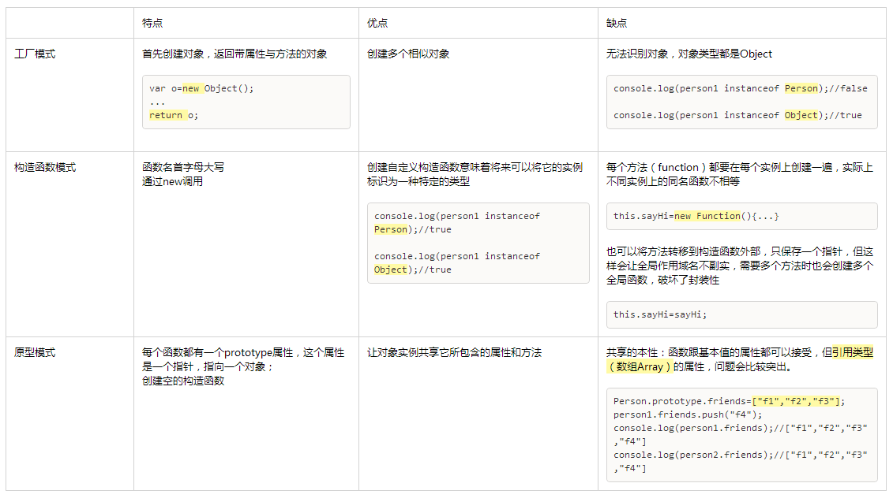

# 第六章 面向对象的程序设计

## 创建对象



1. 工厂模式
    ```
    function createPerson(name,age,job){
        var o = new Object();
        o.name = name;
        o.age = age;
        o.job = job;
        o.sayName = function(){
            alert(this.name);
        };
        return o;
    }
    var person1 = createPerson("Strange",27,"Doctor");
    ```
2. 构造函数模式
    ```
    function Person(name,age,job){
        this.name = name;
        this.age = age;
        this.job = job;
        this.sayName = sayName;
    }
    function sayName(){
        alert(this.name);
    }
    var person1 = new Person("Strange",27,"Doctor");
    ```
3. 原型模式
    ```
    function Person(){}
    Person.prototype = {
        constructor : Person,
        name : "Nick",
        age :29,
        job : "Engineer",
        sayName : function(){
            alert(this.name)
        }
    }
    var person1 = new Person();
    ```
4. 组合使用构造函数模式和原型模式（最常用）
    ```
    function Person(name,age,job){
        this.name = name;
        this.age = age;
        this.job = job;
        this.friends = ["Shelby","Court"];
    }
    Person.prototype = {
        constructor : Person,
        sayName : function(){
            alert(this.name)
        }
    }
    var person1 = new Person("Strange",27,"Doctor");
    ```
5. 动态原型模式
    ```
    function Person(name,age,job){
        this.name = name;
        this.age = age;
        this.job = job;
        if(typeof this.sayName!="function"){
            Person.prototype.sayName = function(){
                alert(this.name);
            }
        }
    }
    var person1 = new Person("Strange",27,"Doctor");
    person1.sayName();
    ```
6. 寄生构造函数模式（不推荐）
    ```
    function Person(name,age,job){
        var o = new Object();
        o.name = name;
        o.age = age;
        o.job = job;
        o.sayName = function(){
            alert(this.name);
        };
        return o;
    }
    var person1 = new Person("Strange",27,"Doctor");
    ```
7. 稳妥构造函数模式（不推荐）
    ```
    function Person(name,age,job){
        var o = new Object();
        o.sayName = function(){
            alert(this.name);
        }
        return o;
    }
    var person1 = Person("Strange",27,"Doctor");
    person1.sayName();
    ```
    
*-end-*
